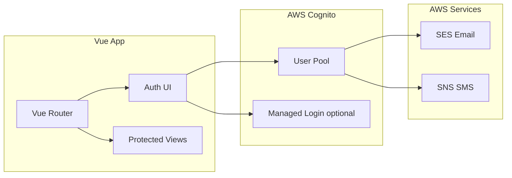

# AWS Cognito Implementation Plan and Feasibility Report

## 1. Feasibility Report: Can AWS Cognito Do All of This?

**Yes.** AWS Cognito can support every feature you asked for, with these conditions:

| Feature                 | Supported | Notes                                                                                            |
| ----------------------- | --------- | ------------------------------------------------------------------------------------------------ |
| Login / Sign in         | Yes       | Username+password, or passwordless (OTP/passkeys)                                                |
| Sign up                 | Yes       | With email/phone verification                                                                    |
| Forgot / Reset password | Yes       | Code sent via email or SMS; user sets new password                                               |
| Email OTP               | Yes       | As sign-in factor or MFA; requires **Essentials/Plus** and your own **Amazon SES**               |
| Mobile (SMS) OTP        | Yes       | As sign-in factor or MFA; uses **Amazon SNS** (or End User Messaging)                            |
| MFA / 2FA               | Yes       | SMS, Email, or TOTP (authenticator app); optional or required                                    |
| Passkeys (WebAuthn)     | Yes       | Passwordless sign-in; requires **Essentials/Plus**; users can register passkeys after first auth |

**Important constraints:**

- **Feature plan:** Use **Essentials** (or Plus) for your user pool. The older "Lite" plan does not support passkeys, email OTP as MFA, or the latest flows.
- **MFA vs passwordless:** You **cannot** set MFA to **required** in a user pool that allows **passkeys** or **OTP as first factor**. So either:
  - **Path A:** Password + optional/required MFA (SMS/Email/TOTP), **no** passkeys/OTP sign-in, or
  - **Path B:** Passwordless (passkeys, email OTP, SMS OTP) with **optional** MFA only.
- **Recovery vs MFA channel:** Password reset and MFA cannot both use the same channel for a user (e.g. if account recovery is "email only," that user cannot use email for MFA). Configure recovery as "email if available, otherwise SMS" (or both) and ensure users have both attributes when using email/SMS MFA.
- **Passkeys:** Available with **Managed Login** (hosted UI) or with **custom UI** via Cognito APIs + WebAuthn (or the [amazon-cognito-passwordless-auth](https://github.com/aws-samples/amazon-cognito-passwordless-auth) sample). Managed Login is the simplest way to get passkey sign-in and setup without building WebAuthn yourself.

---

## 2. High-Level Architecture



**Two implementation approaches:**

| Approach                                                 | Pros                                                                                              | Cons                                                                                                                                                |
| -------------------------------------------------------- | ------------------------------------------------------------------------------------------------- | --------------------------------------------------------------------------------------------------------------------------------------------------- |
| **Managed Login (Hosted UI)**                            | Passkeys, MFA, OTP, forgot password all built-in; minimal frontend code; AWS hosts and secures UI | Less control over look-and-feel; user leaves your domain for sign-in (or embedded in iframe)                                                        |
| **Custom UI (e.g. Amplify Authenticator + Cognito API)** | Full control over UX; stays on your domain; same Cognito user pool                                | Passkey support in custom UI requires more work (APIs + WebAuthn or community/sample code); you implement each flow (sign up, MFA, forgot password) |

**Recommendation:** Start with **Amplify Gen 2 + Authenticator** for Vue to get sign-up, sign-in, forgot password, and MFA (TOTP, and SMS/Email if configured) quickly in your app. Add **Managed Login** only for the passkey flows (redirect to Cognito for sign-in/setup), or later adopt the passwordless sample/APIs for a fully custom passkey experience.

---

## 3. AWS Resources and Configuration

- **User pool (Essentials or Plus)**
  - Sign-in: allow at least **PASSWORD** (or **PASSWORD_SRP**). If you want passwordless-only users, add **EMAIL_OTP**, **SMS_OTP**, and/or **WEB_AUTHN** in "choice-based" or "client-based" sign-in (Essentials/Plus).
  - **Account recovery:** e.g. "Email if available, otherwise SMS" so both MFA and recovery work.
  - **MFA:** Optional (recommended if you enable passkeys/OTP sign-in) or Required (only when not using passkeys/OTP as first factor). Enable SMS, Email (requires SES), and/or TOTP as needed.
  - **Passkeys:** Enable in Sign-in experience (Essentials/Plus); users register passkeys after first sign-in (Managed Login handles this; custom UI needs WebAuthn + Cognito APIs or the passwordless sample).
- **App client(s):** Create a "public" app client for the Vue SPA (no client secret); configure callback/sign-out URLs and OAuth scopes if using Hosted UI.
- **SES:** Verify domain/addresses and configure Cognito to use SES for email (verification + optional email OTP MFA).
- **SNS:** Configure for SMS (verification + optional SMS OTP MFA) and leave sandbox or request production access for real users.

No code changes are required in the app for this section; it is all in AWS Console (or IaC).

---

## 4. Frontend Implementation (Vue 3 App)

**Current stack:** Vue 3, Vue Router, Vite; no auth yet (`src/main.js`, `src/App.vue`, `src/router/index.js`).

**Suggested steps:**

1. **Install and configure Amplify**
   - Add `aws-amplify` and `@aws-amplify/ui-vue` (and optionally Amplify Gen 2 backend if you use it).
   - In `main.js`, configure Amplify with your Cognito User Pool ID and App Client ID (and region).
   - Optionally configure the Hosted UI URL/redirect for passkey flows.
2. **Wrap the app with Authenticator**
   - In `src/App.vue`, wrap the existing layout (nav + `<RouterView />`) with `<Authenticator>` so unauthenticated users see sign-in/sign-up; authenticated users see your app.
   - Use `useAuthenticator()` where you need auth state (e.g. show "Sign out," username).
3. **Router and protected routes**
   - In `src/router/index.js`, add a `beforeEach` that checks auth (e.g. `getCurrentUser()` or Amplify's auth state). Redirect unauthenticated users to a sign-in route or let the Authenticator handle it at app level.
   - Mark protected routes with `meta: { requiresAuth: true }` and redirect to sign-in when not authenticated.
4. **Auth views and flows**
   - Rely on Authenticator for: sign-up, sign-in, confirm sign-up (email/phone code), forgot password, confirm forgot password, and MFA (TOTP setup and challenge; SMS/Email if enabled in user pool).
   - Optional: dedicated routes (e.g. `/login`, `/signup`, `/forgot-password`) that render the Authenticator in a specific initial state for better deep-linking.
5. **Passkeys (two options)**
   - **Option A – Managed Login:** Add a "Sign in with passkey" (or "Sign in with Cognito") button that redirects to Cognito Hosted UI; after sign-in/setup passkey, Cognito redirects back to your app with tokens. Configure Amplify to use Hosted UI for that flow.
   - **Option B – Custom UI:** Use Cognito APIs plus WebAuthn (or the [amazon-cognito-passwordless-auth](https://github.com/aws-samples/amazon-cognito-passwordless-auth) SDK) to implement passkey registration and authentication in your Vue app; more code and testing.
6. **Environment variables**
   - Store User Pool ID, App Client ID, and region in `.env` (e.g. `VITE_USER_POOL_ID`, `VITE_APP_CLIENT_ID`, `VITE_REGION`) and use them in Amplify config. Do not commit secrets; use public client IDs only.
7. **Sign out and token handling**
   - Use Amplify's `signOut()` for sign-out; Amplify will handle token refresh if configured. For API calls, attach the ID or access token from Amplify's auth state.

---

## 5. Flow Summary (How It All Works Together)

- **Sign up:** User submits email/phone and password → Cognito sends verification code → user confirms → account created.
    - **Resend Code:** Users can request a new verification code if they didn't receive the first one. For security, this is limited to **3 attempts** per session.
- **Sign in:** User enters username + password → if MFA optional/required and configured, Cognito returns MFA challenge → user submits SMS/Email/TOTP code → tokens issued.
- **Forgot password:** User requests reset → Cognito sends code to email or SMS (per recovery settings) → user submits code + new password → password updated.
- **Email/SMS OTP:** As MFA: after password, Cognito sends OTP to email or phone; user enters code. As sign-in (passwordless): enable EMAIL_OTP/SMS_OTP in user pool; user requests OTP and signs in with code (no password).
- **Passkeys:** User signs in once (e.g. password + MFA), then in Managed Login can register a passkey; next time can choose "Sign in with passkey" and complete WebAuthn; or use custom UI with WebAuthn + Cognito APIs.

---

## 6. Checklist Before Implementation

- Create or select a user pool on **Essentials** (or Plus) plan.
- Decide: **MFA required** (no passkeys/OTP sign-in) vs **passkeys/OTP sign-in** (MFA optional).
- Configure account recovery (e.g. email + SMS) and ensure MFA and recovery do not use the same single channel per user.
- Set up SES (and SNS if using SMS); connect Cognito to SES for email.
- Create an app client (public, no secret) and note User Pool ID, Client ID, region.
- Add Amplify + Authenticator to the Vue app and configure with the above.
- Add route protection and optional Hosted UI link for passkeys.

This plan gives you a single place (Cognito) for login, signup, reset password, email/mobile OTP, MFA, and passkeys, within the constraints above. If you prefer "custom UI only" or "Managed Login for passkeys," the implementation steps can be narrowed to one of the two paths and broken into concrete file-level edits next.

---

## 7. CDK Script for AWS Resources

A simple CDK app will live in an **`infra/`** directory in the same codebase, at the **same level as the `docs/` folder** (i.e. repo root). Both `docs/` and `infra/` are siblings. The CDK app provisions Cognito, Lambda, API Gateway, and DynamoDB so the Vue app can use one backend.

**Layout:**
```
repo-root/
├── docs/           # Planning and design docs
├── infra/          # CDK app (Cognito, Lambda, API Gateway, DynamoDB)
├── src/            # Vue app
├── package.json
└── ...
```

### 7.1 Resources to Create

- **Cognito User Pool** – Auth (sign up, sign in, MFA, recovery). Essentials plan; email + optional phone; account recovery "email if available, otherwise SMS"; optional MFA (TOTP).
- **Cognito User Pool App Client** – Public client (no secret) for the Vue SPA; callback/sign-out URLs via context or env.
- **Lambda** – One Node.js function (e.g. GET returns a message, can read/write DynamoDB).
- **API Gateway** – REST or HTTP API with a Cognito User Pool authorizer; integration to Lambda.
- **DynamoDB** – One table (e.g. partition key `pk`); Lambda granted read/write.

Optional later: SES for Cognito email; SNS for SMS OTP/MFA.

### 7.2 File Layout

- `infra/package.json` – CDK deps: `aws-cdk-lib`, `constructs`; script `"cdk": "cdk"`.
- `infra/cdk.json` – app entry `node bin/app.js`, no build.
- `infra/bin/app.js` – instantiates the stack with `env` (account/region).
- `infra/lib/cognito-api-stack.js` – Single stack: User Pool, Client, Lambda, API Gateway (Cognito authorizer), DynamoDB; outputs User Pool ID, Client ID, API URL, Table name.
- `infra/lambda/hello.js` – Small handler (optional DynamoDB read) for the API.

### 7.3 Stack Logic (Summary)

- **Cognito:** `UserPool` (sign-in with email/username, standard attributes, password policy, account recovery, MFA optional); `UserPoolClient` (no secret, OAuth flows, callback URLs from context).
- **DynamoDB:** `Table` with partition key `pk` and sort key `sk`.
    - **Stable Partition Key:** Uses the Cognito `sub` (unique UUID) as the Partition Key (`USER#<sub-uuid>`). This ensures user profiles remain intact even if their email address changes.
    - **Data Synchronization:** Profile data (like email) is updated on every login via the `PostAuthentication` trigger to ensure the database remains in sync with the Cognito User Pool.
- **Lambda:** `NodejsFunction` or `Function`; env `TABLE_NAME`; `table.grantReadWriteData(lambda)`.
- **API Gateway:** `RestApi` or `HttpApi`; `CognitoUserPoolsAuthorizer`; resource + Lambda integration; deploy stage.
- **Outputs:** User Pool ID, Client ID, API endpoint URL, Table name (for Vue `.env`).

### 7.4 Commands

- From `infra/`: `npm install`, `npx cdk bootstrap` (once per account/region), `npx cdk deploy`.
- Optional at repo root: script `"infra:deploy": "cd infra && npx cdk deploy"`.

### 7.5 Language

- Use **JavaScript (ESM)** in `infra/` for a simple setup without a TypeScript build step.
